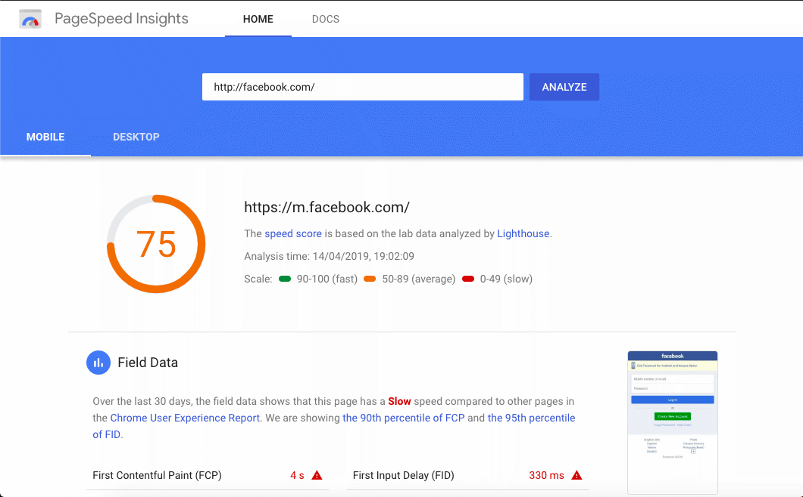
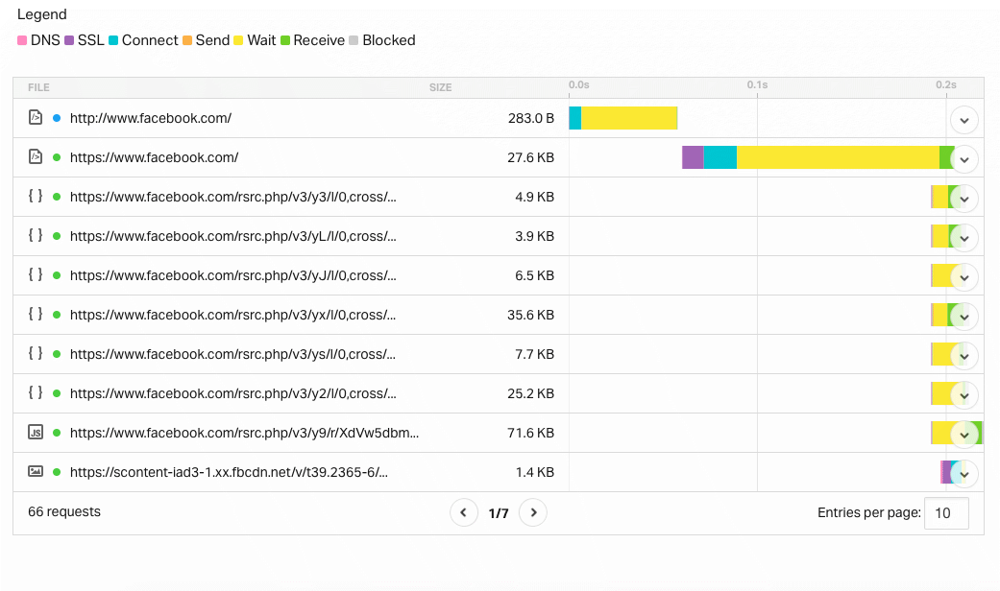

Our tips on how to check the speed of your website and make sure it's as fast as possible. Where to start, what to look for and how to fix it.

Firstly, you may *feel* your website is slow but how can you make sure it's slow for everybody and not just slow on your broadband?

##How to check your website speed

1.[Google's Page Speed Insights](https://developers.google.com/speed/pagespeed/insights/) is a great place to start. If you plug-in your domain name it will give you a score for mobile users and for desktop users. It also gives a series of recommendations to speed your site up.

*This is PageSpeed's analysis of FaceBook's performance*

2.[Pingdom](http://tools.pingdom.com/fpt/) is also very good and with give you a waterfall loading scheme of the times the various parts of your website take to load, and advice on what to tackle to speed it up/

Both these tools will give you a list of issues to address. Some of them can be tackled by a beginner, others may need expert help. Here is a list of which things to start tackling:

##1. Check your server
Regardless of what PageSpeed or Pingdom might say, sometimes your speed can be changed by upgrading your server. If you're on a shared server contract there are a number of ways to upgrade. You can go to a managed hosting, a dedicated server or to a cloud service. 

You can check where your website is hosted here: [hosting checker](https://hostingchecker.com/). If you are a local business even simply moving your server to the same country or continent can make a difference. 

If your site gets used internationally then a cloud server might make sense as it will balance the traffic according to demand.

That said, let's move onto the site itself:

##1. Keep HTTP requests to a minimum
Everytime somebody asks to see your site their browser will send a request to the server. Each of these requests - that can be an image, or a css or js file -  has to be processed and takes up a little time. The size of the file also determines the response time so bundling everything into one big file is not the answer. To do it well takes a little time - google normally advocate prioritising data needed for showing the visitors the top fo the page - the so-called "above the fold".

[Pingdom](http://tools.pingdom.com/fpt/) will give you a list of of all the HTTP requests your page makes and you can quickly find the main culprits.

*Pingdom's cascading loading schema for FaceBook*

It's worth remembering that every exciting bell and whistle comes with a script to run it, and an HTTP request to go with it. Each one of those requests will slow the page load. Here are some examples of external requests:

1. External commenting systems 

2. Pop up boxes like LiveChat

3. Website analytics

4. External Fonts

5. Facebook feeds

Making sure you only add extra services and plugins when you really need them can make a big difference. If you're using WordPress you can try turning the plugin off and re-testing to see the timiing results immediately.

##2. Optimise your images
Images are often the data hogs in websites. It's worth spending a little time minimising your images and resizing them. You can do it yourself with programs like Fireworks, Affinity or Photoshop, or you can use an online service like [Optimizilla](https://imagecompressor.com/).

##3. Load any JavaScript *asynchronously*
When a browser requests a web-page it will first read the *head* then the *body*. Any intructions in the *head* have to load before the *body* will render so if the *head* has lots of intructions in it they will slow the page render. 

One way to get round this is to use *asynchronous* loading which speeds up the page render by allowing certain elelments to load without waiting for all the external resources. For an excellent explanation of this, have a look at this page on [Optimizely](https://help.optimizely.com/Set_Up_Optimizely/Synchronous_and_asynchronous_snippet_loading)

##4. Use Cache
When you visit a website your computer or device will keep a copy of the page for a while. This means that next time you visit the same site your device can pull sections of the content from its own memory, dramatically speeding up load times.

If you have a good and explicit caching strategy you can help the browser determine which content to keep and which might change. Logos, css files or style sheets, js files and media content are all good condidates for caching. Essentially you need to tell the browser how likely the content is to change and set markers to alert the browser when change has happened.

The most common tags are `Cache-Control` (which is a modern replacement for `Expires`), `Last-Modified` which is fairly self-explanatory and `Etag` which is a method for the browser to check if the content it has has changed. If the content hasn't changed the `Etag` will tell the browser it can carry on using the cached content.

For an excellent explanation of Caching, have a look at this page on [DigitalOcean](https://www.digitalocean.com/community/tutorials/web-caching-basics-terminology-http-headers-and-caching-strategies)

